# fractol
fractal explorer

# usage :

fractol [-h] fractale_id [iterations_nb] [colormode 0-6] :
                         [default 16   ] [default 4    ] :
-h : display this help and exit

# explorer keymaps :

#### Q,ESC
  quit program
#### J,K
  change fractale
#### D,F
  decrease, increase iteration number
#### H
  change color mode
#### U
  change color channel
#### V
  display/hide verbose panel
#### I
  reset zoom, it_max, color mode and color channel to default
#### M, mouse wheel up
  zoom
#### COMMA, mouse wheel down
  dezoom
#### L
  lock/unlock mouse dependancy for julias fractales

# fractales :

1: mand

  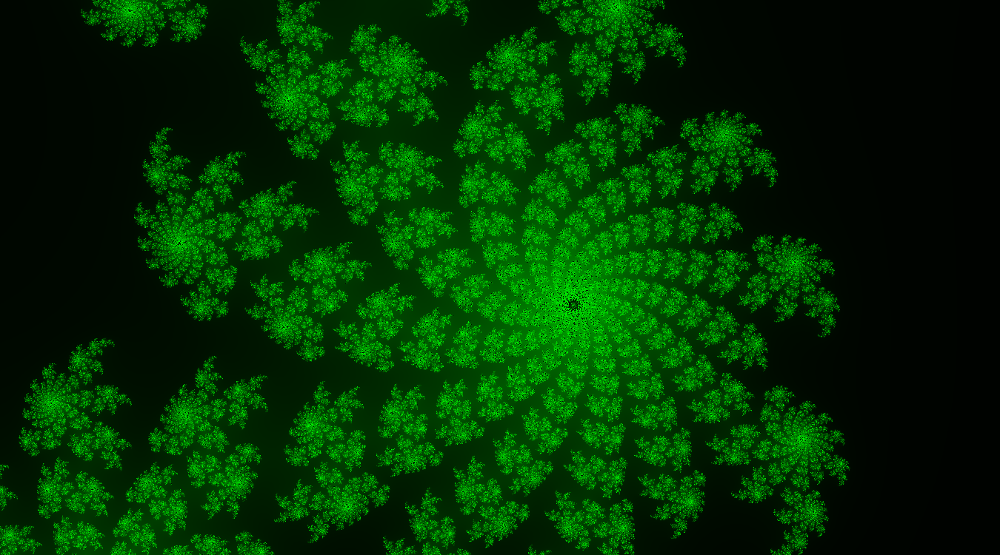

2: bship

  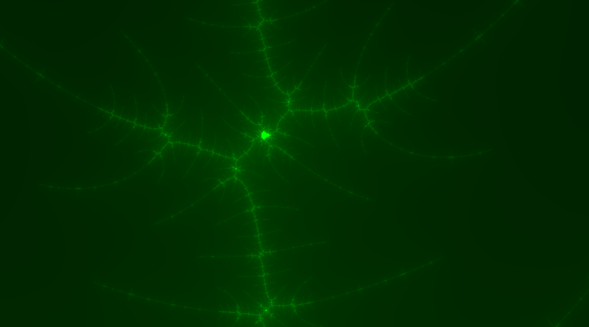

3: dmand

  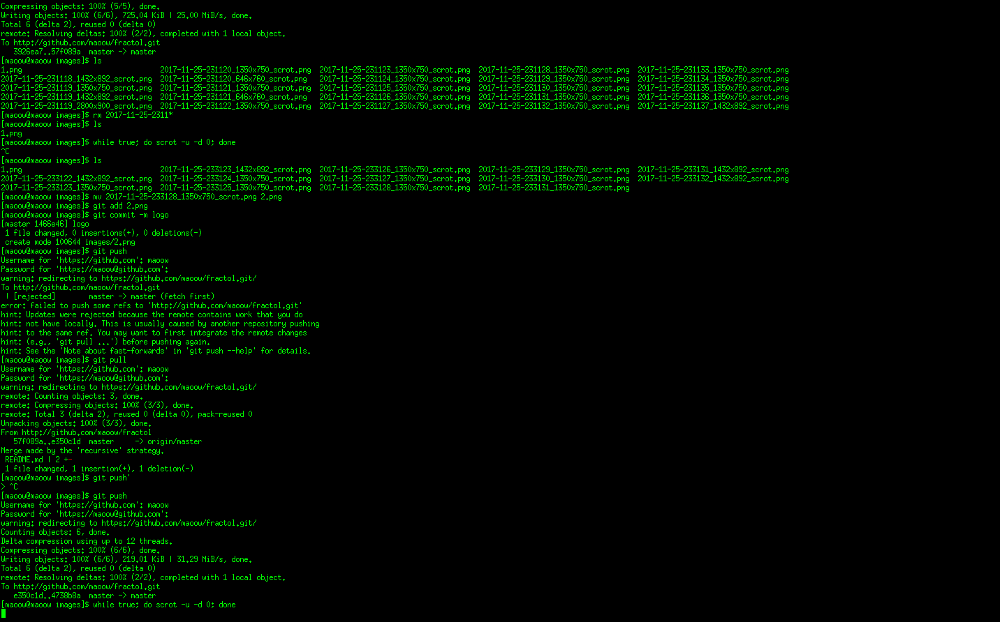

4: tmand

  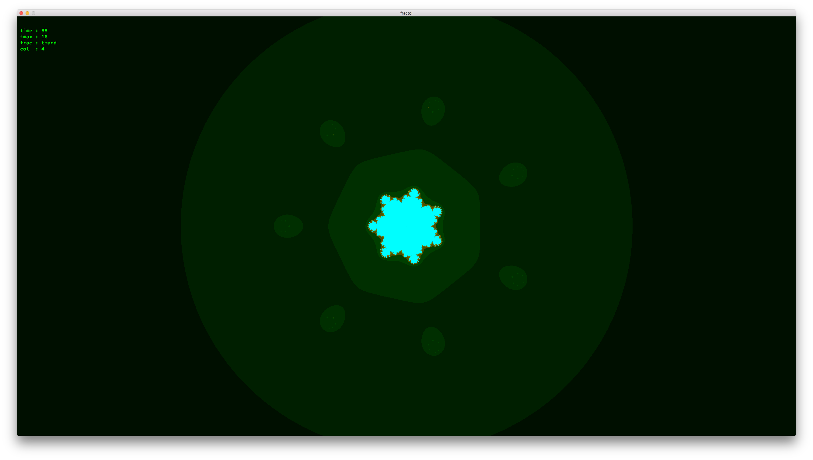

5: ju

  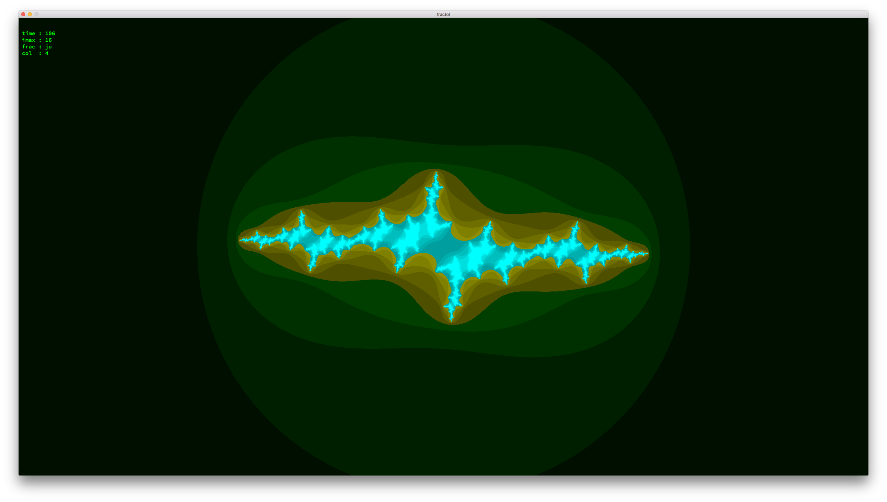

6: dju

  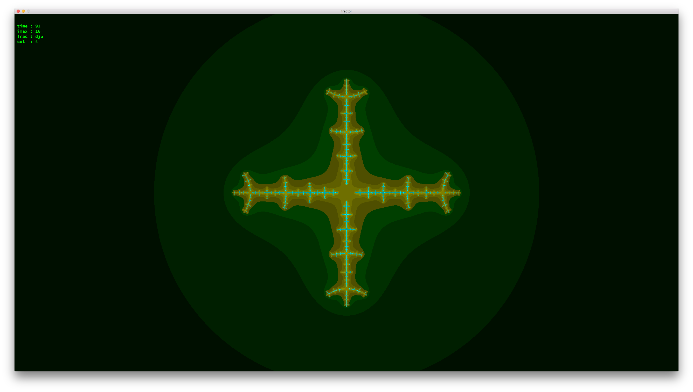

7: tju

  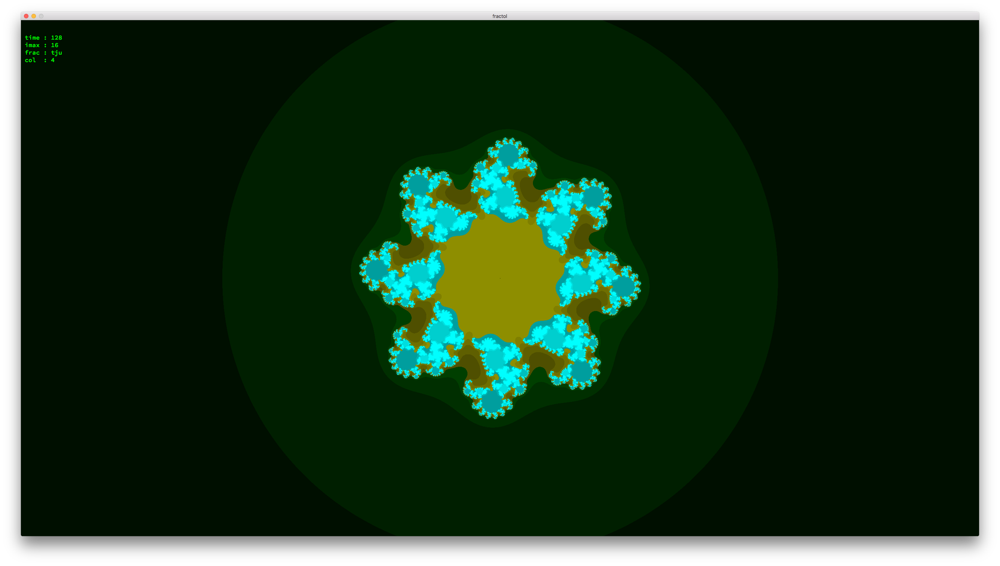

8: absju

  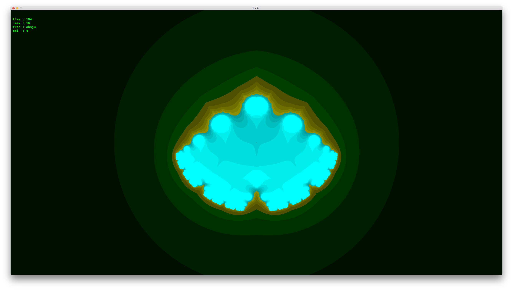

9: buble

  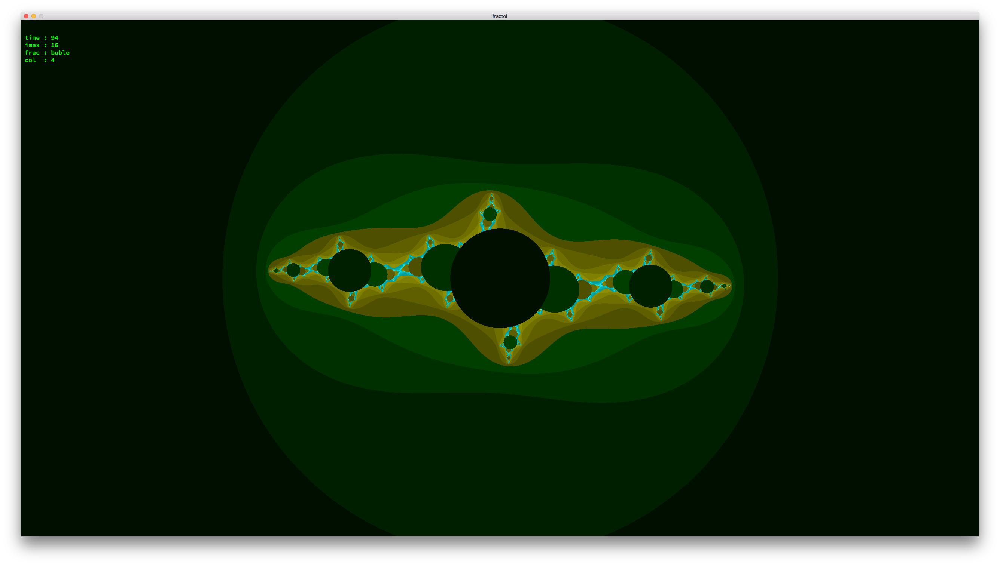

10: dbuble

  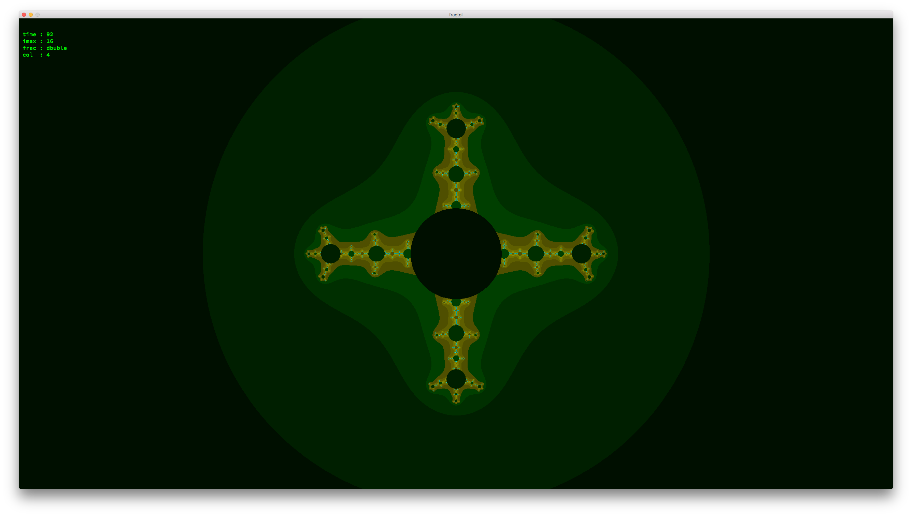

11: tbuble

  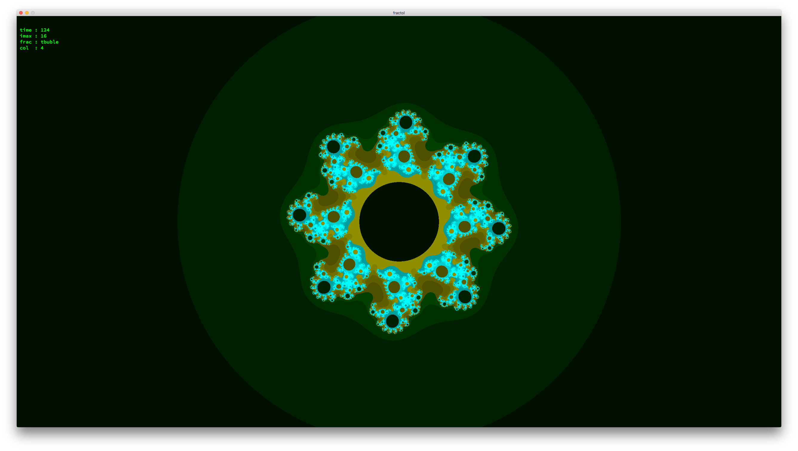

12: absbub

  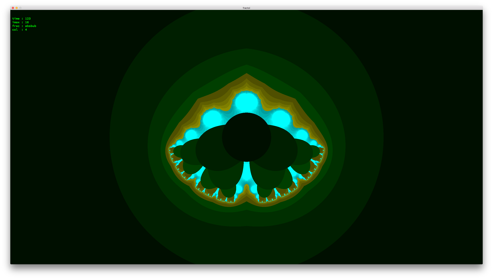

13: buddha

  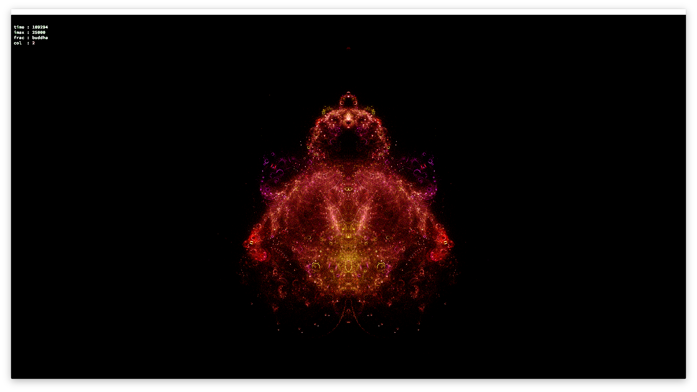

