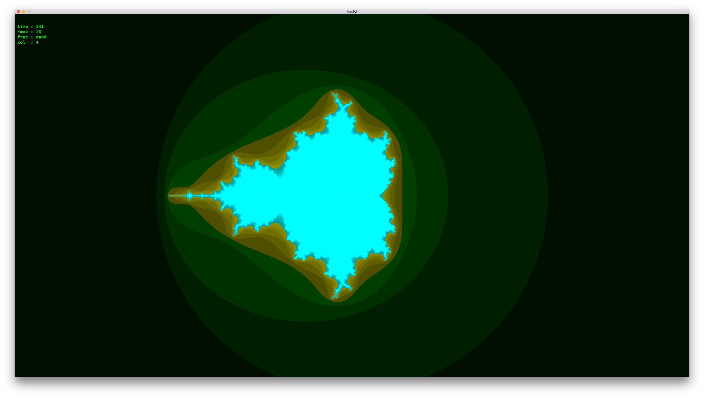
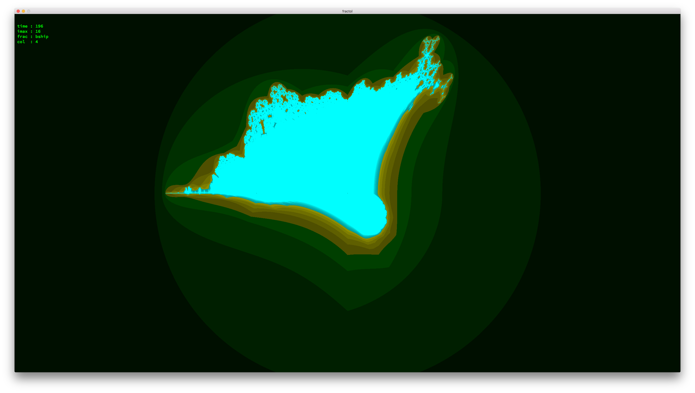
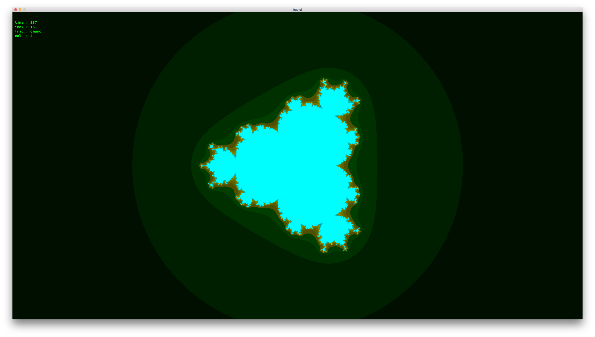

# fractol
fractale explorer as 42 project

fractol [-h] fractale_id [iterations_nb] [colormode 0-6] :
                         [default 16   ] [default 4    ] :
-h : display this help and exit

fractales :
[1]: mand

  

[2]: bship

  

[3]: dmand

  

[4]: tmand

  

[5]: ju

  

[6]: dju

  

[7]: tju

  

[8]: absju

  

[9]: buble

  

[10]: dbuble

  

[11]: tbuble

  

[12]: absbub

  

[13]: buddha

  

